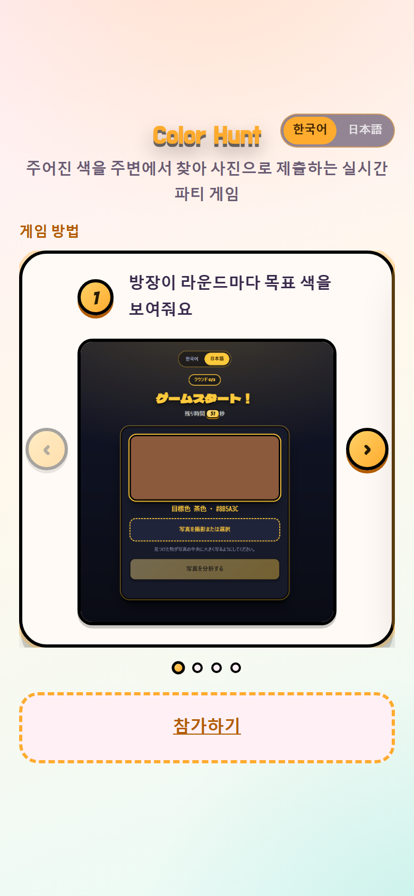
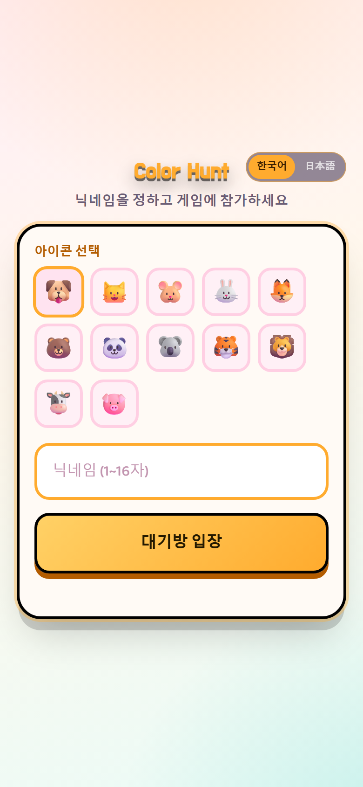
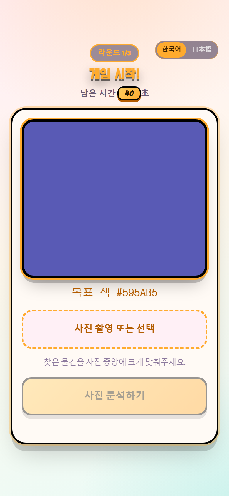
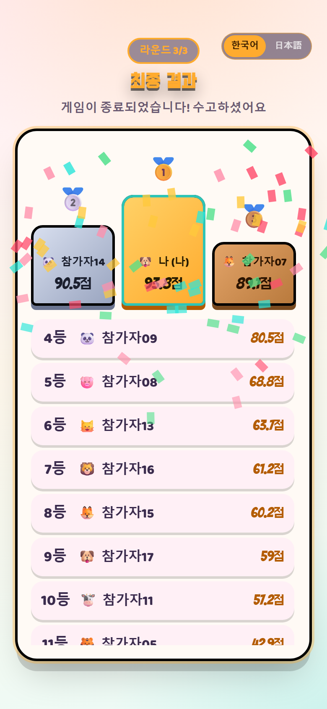
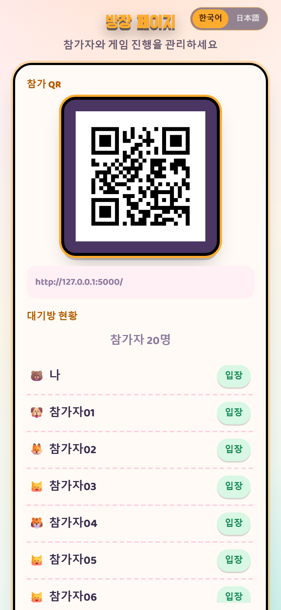

# Color Hunt

このプロジェクトの README は日本語と韓国語で提供されています。
이 프로젝트의 README는 일본어와 한국어로 제공됩니다.

- [日本語 (Japanese)](README.md)
- [한국어 (Korean)](README_ko.md)

---

QR코드로 입장해서, 제시된 색과 닮은 물건을 주변에서 찾아 사진으로 제출하는 실시간 파티 게임입니다.
방장 PC 한 대와 참가자들의 스마트폰만 있으면 같은 와이파이(또는 인터넷) 위에서 바로 진행할 수 있습니다.

## 목차

1. [스크린샷](#스크린샷)
2. [주요 기능](#주요-기능)
3. [팀원](#팀원)
4. [시스템 구성](#시스템-구성)
5. [기술 스택](#기술-스택)
6. [기술적 과제와 해결](#기술적-과제와-해결)
7. [실행 방법](#실행-방법)
8. [AWS 배포](#aws-배포)
9. [AI 모델 안내](#ai-모델-안내)
10. [프로젝트 구조](#프로젝트-구조)

---

## 스크린샷

| 인트로 | 닉네임/아바타 선택 | 게임 진행 |
| :---: | :---: | :---: |
|  |  |  |

| 최종 결과 | 방장 화면 |
| :---: | :---: |
|  |  |

---

## 주요 기능

- **QR 참가**: 방장이 `/host`에서 QR코드를 띄우면 참가자는 스캔만으로 입장
- **게임 방법 인트로**: 처음 접속 시 4단계 슬라이드로 규칙을 먼저 안내
- **아바타 선택**: 동물 이모지 12종 중 하나를 골라 닉네임과 함께 입장, 대기방·순위표·포디움에 계속 표시
- **랜덤 목표 색**: 매 라운드 완전 무작위 RGB 색상을 제시 (총 3라운드)
- **AI 사진 채점**: 제출한 사진에서 목표 색과 가장 가까운 물체/영역을 찾아 색상 유사도(80%) + 제출 속도(20%)로 점수 산정
- **실시간 동기화**: 대기방·진행 현황·순위표가 폴링으로 자동 갱신
- **방장 조작**: 게임 시작/다음 라운드/결과 발표/초기화, 그리고 **전원 제출 완료 시 타이머를 기다리지 않고 바로 결과 화면으로 종료**하는 기능
- **한국어 / 日本語** 전체 UI 다국어 지원
- **최종 결과 컨페티 연출**과 포디움(1~3등 시상대) 표시

---

## 팀원

| 역할 | 담당 내용 |
| --- | --- |
| 서버 · 게임 로직 | Flask 앱 구조, 게임 상태 관리(`game_state.py`), 참가자·관리자 API, QR 생성, 사진 분석 파이프라인 |
| 참가자 화면 · 디자인 | 화면 라우팅(`routes/player.py`), 템플릿, 전체 UI/UX 디자인, 프론트 JS |
| QA · 운영 | 여러 기기에서 QR 접속 테스트, 닉네임 중복·제출·타이머·초기화 시나리오 검증, 한/일 번역 검수 |

> GitHub: [Gapsick/findcolor](https://github.com/Gapsick/findcolor)

---

## 시스템 구성

```
참가자 스마트폰 (Safari / Chrome)
        │  QR 스캔 → HTTP(폴링)
        ▼
   Flask 서버 (단일 프로세스)
   ├─ 게임 상태 (메모리, GameRoom)
   ├─ 참가자/관리자 라우트
   └─ 이미지 분석 파이프라인
        ├─ YOLO11n-seg  (1차, 물체 탐지)
        ├─ LAB 색상 영역 탐지 (2차, 배경 폴백)
        └─ SlimSAM       (3차, GPU 전용 폴백)
        ▲
        │  방장 PC (같은 서버를 /host 로 접속)
   방장 스마트폰 또는 PC
```

게임 상태는 DB 없이 서버 프로세스 메모리에서 관리되는 구조라, **웹 프로세스는 반드시 1개만 실행**해야 합니다.

---

## 기술 스택

| 구분 | 사용 기술 |
| --- | --- |
| 백엔드 | Python, Flask |
| AI / 이미지 분석 | Ultralytics YOLO11n-seg, SlimSAM(Transformers), OpenCV, Pillow, PyTorch |
| 프론트엔드 | Jinja2 템플릿, Vanilla JS, CSS (커스텀, 자체 호스팅 웹폰트) |
| 인증 · 설정 | Flask Session, `python-dotenv`(.env) |
| 배포 | AWS EC2(Ubuntu) + systemd, 로컬 LAN 배포 병행 지원 |

---

## 기술적 과제와 해결

### 문제: 20명이 동시에 사진을 제출하면?

무거운 모델 하나로 사진 1장을 분석하는 데 약 3초가 걸린다고 하면, 20명이 비슷한 시점에 제출할 경우 순차 처리 시 `3초 × 20명 = 60초`가 걸립니다. 실시간 파티 게임에는 맞지 않는 지연이었습니다.

### 해결

1. **가벼운 모델 채택** — YOLO 계열 중 가장 가벼운 **YOLO11n(nano)** 사용. 큰 모델 대비 훨씬 빠르면서 일반적인 물체 인식엔 충분
2. **GPU 자동 감지** — `torch.cuda.is_available()`로 GPU 유무를 감지해 자동으로 device를 선택, 배포 환경을 가리지 않음
3. **요청 배치 처리** — 사진이 들어올 때마다 즉시 처리하지 않고, **80ms 안에 도착한 요청을 최대 20장까지 모아 한 번의 배치 추론**으로 처리. GPU는 이미지 1장과 20장을 배치로 처리하는 시간 차이가 크지 않으므로, `인원 수 × 처리시간`이 아니라 `배치 1회` 수준으로 지연이 줄어듭니다.

추가로 **단계적 폴백 구조**로 자원을 아낍니다.

| 단계 | 방식 | 비용 | 사용 조건 |
| --- | --- | --- | --- |
| 1차 | YOLO11n-seg 물체 탐지 | 낮음 | 항상 시도 |
| 2차 | LAB 색상 영역 탐지 | 매우 낮음 | YOLO가 못 찾았을 때 (잔디·벽 등 배경) |
| 3차 | SlimSAM | 높음 | 그래도 못 찾았고, **GPU가 있을 때만** |

가장 좋은 모델 하나만 쓰는 대신, 상황과 장비에 맞는 도구를 단계적으로 선택하는 구조로 설계했습니다.

---

## 실행 방법

```powershell
python -m venv .venv
.venv\Scripts\pip install -r requirements.txt
```

`.env` 파일을 만들어 다음 값을 설정합니다 (`.gitignore`에 포함되어 git에는 올라가지 않습니다):

```
COLORHUNT_SECRET=아무-랜덤-문자열
COLORHUNT_ADMIN_PIN=방장-PIN
```

```powershell
.venv\Scripts\python app.py
```

- 참가자: `http://<PC의-IP>:5000/`
- 방장: `http://<PC의-IP>:5000/host`

같은 와이파이가 아니라 인터넷으로 배포하려면 아래 [AWS 배포](#aws-배포)를 참고하세요.

---

## AWS 배포

학교·회사 와이파이처럼 기기 간 통신이 막혀있어 같은 와이파이로 접속이 안 되는 환경에서는, AWS EC2에 올려서 인터넷으로 접속하게 할 수 있습니다. [`deploy/`](deploy/) 폴더에 필요한 스크립트를 미리 준비해뒀습니다.

### 1. EC2 인스턴스 생성

- OS: **Ubuntu 22.04 이상 LTS**
- 인스턴스 타입: **t3.medium 이상** 권장 (torch/ultralytics가 메모리를 꽤 사용해서 t2.micro/t3.micro 등 프리티어 사양은 부족할 수 있음)
- 키 페어: **새 키 페어 생성** 후 `.pem` 파일 다운로드 (없으면 이후 SSH 접속 불가)
- 보안 그룹(방화벽): 인바운드 규칙에 **SSH(22)** 와 **사용자 지정 TCP 5000**(소스 `0.0.0.0/0`) 추가
- 스토리지: **20~30GB 이상** 권장 (기본 8GB는 파이썬 패키지 설치하기엔 빠듯함)

### 2. 접속 후 설치

```bash
ssh -i "다운받은키.pem" ubuntu@<EC2-퍼블릭IP>

git clone https://github.com/Gapsick/findcolor.git colorhunt
cd colorhunt
bash deploy/setup_ec2.sh
```

### 3. `.env` 옮기기

`.env`는 git에 없으므로 내 PC에서 직접 복사합니다.

```powershell
scp -i "다운받은키.pem" .env ubuntu@<EC2-퍼블릭IP>:~/colorhunt/.env
```

### 4. 계속 켜져 있도록 systemd 등록

```bash
sudo cp deploy/colorhunt.service /etc/systemd/system/colorhunt.service
# WorkingDirectory가 실제 clone 위치와 다르면 이 파일 안에서 수정
sudo systemctl daemon-reload
sudo systemctl enable --now colorhunt
sudo systemctl status colorhunt   # active (running) 확인
```

### 5. 접속 확인

- 참가자: `http://<EC2-퍼블릭IP>:5000`
- 방장: `http://<EC2-퍼블릭IP>:5000/host`

> ⚠️ 행사가 끝나면 EC2 인스턴스를 **중지(Stop)** 하거나 **종료(Terminate)** 하세요. 켜둔 시간만큼 계속 요금이 청구됩니다.

---

## AI 모델 안내

기본 분석은 저장소의 `backend/yolo11n-seg.pt`를 사용합니다. GPU가 있으면 자동으로 CUDA를 선택합니다.

YOLO가 학습하지 않은 잔디, 벽, 바닥 같은 영역은 빠른 LAB 색상 영역 탐지로 보완하고, 연속된 가장 큰 유사색 영역의 외곽선을 표시합니다.

서버 시작 시 모델을 워밍업하고 80ms 안에 도착한 요청을 최대 20장까지 자동으로 묶어 배치 추론합니다.

YOLO가 물체를 찾지 못했을 때 GPU 환경에서만 SlimSAM 폴백을 사용합니다. SlimSAM 체크포인트는 한 번만 내려받으면 됩니다.

```powershell
python -c "from transformers import SamModel, SamProcessor; SamProcessor.from_pretrained('Zigeng/SlimSAM-uniform-50'); SamModel.from_pretrained('Zigeng/SlimSAM-uniform-50')"
```

모델은 사용자 캐시에 저장되며 이후 실행에서는 다시 다운로드하지 않습니다.

---

## 프로젝트 구조

```text
app.py                      실행 진입점 (.env 로드, 앱 생성)
backend/
  game_state.py              참가자, 타이머, 아바타, 목표 색, 라운드 상태
  i18n.py                    한국어/일본어 번역
  image_analysis.py          사진 분석 파이프라인 (YOLO → LAB → SlimSAM)
  yolo_segmentation.py        YOLO11n-seg + 요청 배치 처리
  sam_segmentation.py         SlimSAM 폴백
  color_region_segmentation.py LAB 색상 영역 탐지 폴백
  qr_utils.py                 참가 QR 생성
  routes/
    player.py                 참가자 화면 라우트 (인트로/입장/대기/게임/결과)
    admin.py                  방장 로그인·대시보드 라우트
    api.py                    참가자·관리자 API
    dev.py                     개발용 미리보기 라우트 (COLORHUNT_DEV=1일 때만)
frontend/
  templates/                  Jinja2 HTML 템플릿
  static/css/style.css         전체 디자인
  static/js/                   화면별 동작 스크립트
  static/fonts/                자체 호스팅 웹폰트
deploy/                      AWS EC2 배포용 스크립트 · systemd 서비스 파일
docs/screenshots/            README용 스크린샷
```
